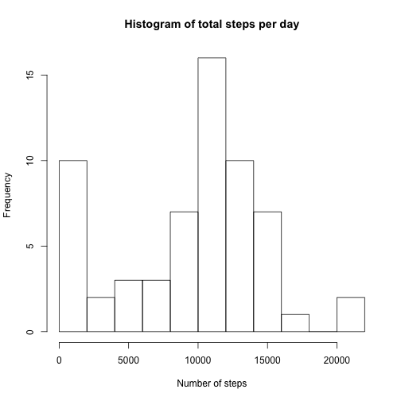
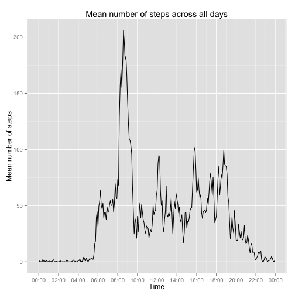
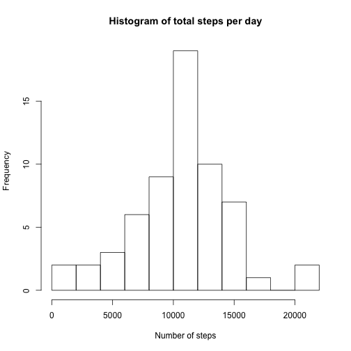
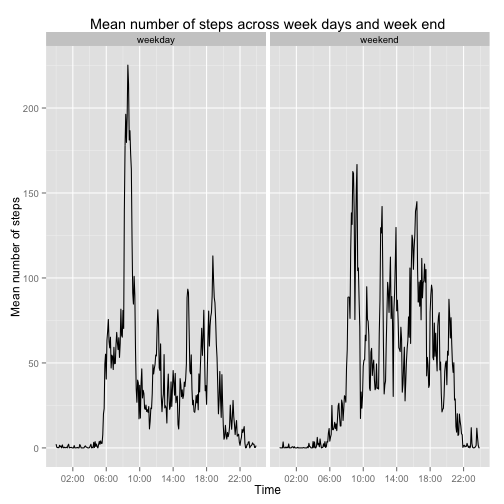

## Environment setting


```r
Sys.setlocale("LC_TIME", "C")
library("ggplot2")
library("dplyr")
library("scales")
```

## Data reading and preprocessing

```r
data <- read.csv(file = "activity.csv", header = T, colClasses = c("integer", "Date", "integer"))
```


```r
data <- mutate(data, intervalPOSIXct = as.POSIXct(strptime(sprintf("%04d", interval), "%H%M")))
data <- mutate(data, dayOfWeek = weekdays(date))
```

## What is mean total number of steps taken per day?

```r
data <- group_by(data, date)
totalStepsPerDay <- summarise(data, totSteps = sum(steps, na.rm = T))
hist(totalStepsPerDay$totSteps, breaks = 10, main = "Histogram of total steps per day", xlab = "Number of steps")
```

 

```r
mean(totalStepsPerDay$totSteps)
median(totalStepsPerDay$totSteps)
```

The mean is **9354.2295082**. The median is **10395**

## What is the average daily activity pattern?

```r
data <- group_by(data, intervalPOSIXct)
meanStepsBy5min <- summarise(data, meanSteps = mean(steps, na.rm = T))
ggplot(meanStepsBy5min, aes(intervalPOSIXct, meanSteps)) + 
    geom_line() + 
    scale_x_datetime(breaks=date_breaks("2 hour"), labels = date_format("%H:%M", tz = "Europe/Paris")) +
    xlab("Time") + 
    ylab("Mean number of steps") +
    ggtitle("Mean number of steps across all days")
```

 


```r
substr(meanStepsBy5min[which.max(meanStepsBy5min$meanSteps),]$intervalPOSIXct, 12, 16)
```


Max interval is **08:35**.

## Imputing missing values

```r
sum(is.na(data$step))
```

There are 2304 rows containing NA for steps.

My strategy is to put the mean number of steps for a day of week and modulate it with the 5-minute interval distribution.


```r
totalStepsPerDay <- mutate(totalStepsPerDay, dayOfWeek = weekdays(date))
totalStepsPerDay <- group_by(totalStepsPerDay, dayOfWeek)
meanByWeekDay <- summarise(totalStepsPerDay, meanSteps = mean(totSteps))

for(i in 1:nrow(data)){
    row <- data[i,]
    if(is.na(row$steps)){
        wD <- row$dayOfWeek
        iH <- row$intervalPOSIXct
        meanD <- as.numeric(meanByWeekDay %>% filter(dayOfWeek == wD) %>% select(meanSteps))
        ratioH <- as.numeric((meanStepsBy5min %>% filter(intervalPOSIXct == iH) %>% select(meanSteps)) / sum(meanStepsBy5min$meanSteps))
        data[i,]$steps <- meanD*ratioH
    }
}

data <- group_by(data, date)
totalStepsPerDayNoNA <- summarise(data, totSteps = sum(steps, na.rm = T))
hist(totalStepsPerDayNoNA$totSteps, breaks = 10, main = "Histogram of total steps per day", xlab = "Number of steps")
```

 

```r
mean(totalStepsPerDayNoNA$totSteps)
median(totalStepsPerDayNoNA$totSteps)
```

The mean is **10571.1976321**. The median is **10571**

## Are there differences in activity patterns between weekdays and weekends?


```r
data<-ungroup(data)
data <- mutate(data, isWeekDay = factor(ifelse(dayOfWeek == "Sunday" | dayOfWeek == "Saturday", "weekend", "weekday")))
data <- group_by(data, isWeekDay, intervalPOSIXct)
meanStepsBy5min <- summarise(data, meanSteps = mean(steps, na.rm = T))

ggplot(meanStepsBy5min, aes(intervalPOSIXct, meanSteps)) +
    geom_line() +
    scale_x_datetime(breaks=date_breaks("4 hour"), labels = date_format("%H:%M", tz = "Europe/Paris")) +
    xlab("Time") +
    ylab("Mean number of steps") +
    ggtitle("Mean number of steps across week days and week end") + 
    facet_grid(.~isWeekDay)
```

 


