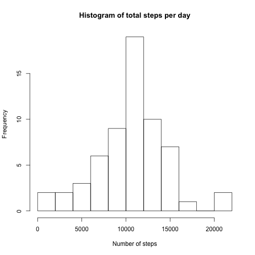
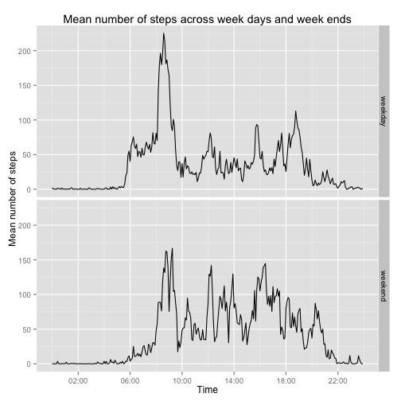

## Environment setting
First thing is to set the environment.

By the way, I had to change the locale so that the week days could be displayed in english.


```r
Sys.setlocale("LC_TIME", "C")
library("dplyr")
library("ggplot2")
library("scales")
```

## Data reading and preprocessing
I read directly the ZIP file.

```r
data <- read.csv(unz("activity.zip", "activity.csv"), header = T, colClasses = c("integer", "Date", "integer"))
```

I prefer to use intervals typed as time, then I create a column *intervalPOSIXct*.
The column *dayOfWeek* will be used to process NA values (it is explained in that section below).

```r
data <- mutate(data, intervalPOSIXct = as.POSIXct(strptime(sprintf("%04d", interval), "%H%M")))
data <- mutate(data, dayOfWeek = weekdays(date))
```

## What is mean total number of steps taken per day?
I use dplyr grouping feature to sum the number of steps for each date. 

```r
data <- group_by(data, date)
totalStepsPerDay <- summarise(data, totSteps = sum(steps, na.rm = T))
hist(totalStepsPerDay$totSteps, breaks = 10, 
     main = "Histogram of total steps per day", xlab = "Number of steps")
```

 

The histogram shows a peak in the lowest bin (0-2000). It comes perhaps from the days with several NA values.

To get mean and median, I simply use the mean and median functions:

```r
mean(totalStepsPerDay$totSteps)
median(totalStepsPerDay$totSteps)
```

The mean for number of steps per day is **9354.23** and the median is **10395**. The mean is notably lower than the median because of the peak in 0-2000 bin.

## What is the average daily activity pattern?
Again, I use the dplyr group_by function to sum the number of steps but this time over the 5-minute intervals. I use *intervalPOSIXct* instead of the original *interval* column to let GGPlot format intervals nicely as time.
By the way, I had to set my time zone to prevent the interpretation of intervals as GMT hours.

```r
data <- group_by(data, intervalPOSIXct)
meanStepsBy5min <- summarise(data, meanSteps = mean(steps, na.rm = T))
ggplot(meanStepsBy5min, aes(intervalPOSIXct, meanSteps)) + 
    geom_line() + 
    scale_x_datetime(breaks=date_breaks("2 hour"), labels = date_format("%H:%M", tz = "Europe/Paris")) +
    xlab("Time") + 
    ylab("Mean number of steps") +
    ggtitle("Mean number of steps across all days")
```

 

The maximum is retrieved with the following command:

```r
substr(meanStepsBy5min[which.max(meanStepsBy5min$meanSteps),]$intervalPOSIXct, 12, 16)
```


Maximum interval returned is **08:35**.

## Imputing missing values

```r
sum(is.na(data$step))
```

There are **2304** rows containing NA for steps.

My strategy is to put the mean number of steps for a day of week and modulate it with the 5-minute interval distribution. The idea is that two mondays, two tuesdays ... should be similar and that the distribution along 5-min intervals is quite stable from a day to another.

I enhance the *totalStepsPerDay* data by adding the name of week day and group the data by that criterion.


```r
totalStepsPerDay <- mutate(totalStepsPerDay, dayOfWeek = weekdays(date))
totalStepsPerDay <- group_by(totalStepsPerDay, dayOfWeek)
meanByWeekDay <- summarise(totalStepsPerDay, meanSteps = mean(totSteps))
```

Then I iterate over the rows. If the *steps* column contains a NA value, I blend the mean number of steps for that day of week with the weight for that 5-minute interval.

```r
for(i in 1:nrow(data)){
    row <- data[i,]
    if(is.na(row$steps)){
        wD <- row$dayOfWeek
        iH <- row$intervalPOSIXct
        meanD <- as.numeric(meanByWeekDay %>% filter(dayOfWeek == wD) %>% select(meanSteps))
        ratioH <- as.numeric((meanStepsBy5min %>% 
                                  filter(intervalPOSIXct == iH) %>% 
                                  select(meanSteps)) / sum(meanStepsBy5min$meanSteps))
        data[i,]$steps <- meanD*ratioH
    }
}

data <- group_by(data, date)
totalStepsPerDayNoNA <- summarise(data, totSteps = sum(steps, na.rm = T))
hist(totalStepsPerDayNoNA$totSteps, breaks = 10, main = "Histogram of total steps per day", 
     xlab = "Number of steps")
```

 

The peak in the 0-2000 bin disappeared now that the NA values have been processed.


```r
mean(totalStepsPerDayNoNA$totSteps)
median(totalStepsPerDayNoNA$totSteps)
```

The mean is now **10571.2** and the median is **10571**. They are now quite similar,  the distribution is more "normal" as in "normal ditribution".

## Are there differences in activity patterns between weekdays and weekends?
As instructed, a factor column is added to distinguished weekdays and weekends.

```r
data<-ungroup(data)
data <- mutate(data, 
           isWeekDay = factor(ifelse(dayOfWeek == "Sunday" | dayOfWeek == "Saturday", "weekend", "weekday")))
data <- group_by(data, isWeekDay, intervalPOSIXct)
meanStepsBy5min <- summarise(data, meanSteps = mean(steps, na.rm = T))

ggplot(meanStepsBy5min, aes(intervalPOSIXct, meanSteps)) +
    geom_line() +
    scale_x_datetime(breaks=date_breaks("4 hour"), labels = date_format("%H:%M", tz = "Europe/Paris")) +
    xlab("Time") +
    ylab("Mean number of steps") +
    ggtitle("Mean number of steps across week days and week ends") + 
    facet_grid(isWeekDay~.)
```

 

The difference is quite obvious: week ends start later and the distribution of number of steps is less skewed toward the morning hours.


